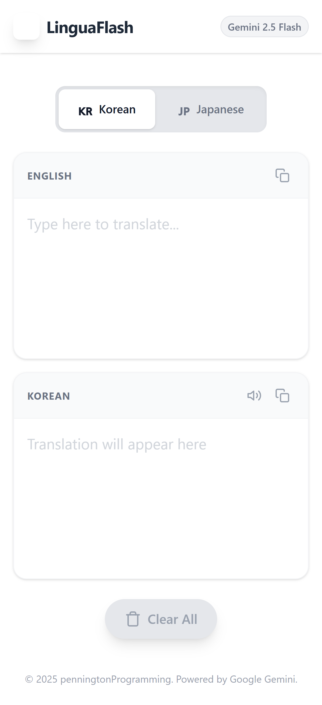

# LinguaFlash

A Real-Time Translator that is a mobile-friendly Progressive Web App (PWA) designed for seamless, real-time text translation and accessibility.

---

## 🌐 Live Demo

🔗 **Live Site:** https://realtimetranslate.netlify.app/

---

## 🚀 Features

### Instant Translation
Translate text in real time:
- English → Korean
- English → Japanese

Users can select their preferred target language easily.

#### Side-by-Side Display
Original text appears on the left, translated text on the right for easy comparison.

#### Text-to-Speech Support
A “Read Aloud” button pronounces the translated text using built-in text-to-speech.

#### Quick Reset
A “Clear All” button instantly clears both text areas for a fresh start.

#### PWA Features
Offline Support
Implemented via service worker (sw.js) for caching and offline functionality.

---

## 🛠 Tech Stack

- **Frontend Framework:** React 19
- **Language:** TypeScript (.ts and .tsx files)
**Styling:** Tailwind CSS
- **AI Integration:** Google GenAI SDK (@google/genai) using gemini-2.5-flash model
- **Web Speech API:** Native browser API (window.speechSynthesis)

---

## 📸 Screenshots




---

## Installation

```bash
git clone https://github.com/egpennington/realtimeTranslator.git
cd realtimeTranslator
npm install
npm run dev
```
---

## 🤝 Contributing

Contributions are welcome!

1. Fork the project  
2. Create your feature branch  
   ```bash
   git checkout -b feature/YourFeature
   ```
3. Commit your changes  
   ```bash
   git commit -m "Add your feature"
   ```
4. Push to your branch  
   ```bash
   git push origin feature/YourFeature
   ```
5. Open a Pull Request  

---

## 📄 License

This project is licensed under the MIT License.

---

## 📬 Contact

Emmett Pennington
[GitHub:](https://github.com/egpennington)  
[Live Project:](https://realtimetranslate.netlify.app/)
